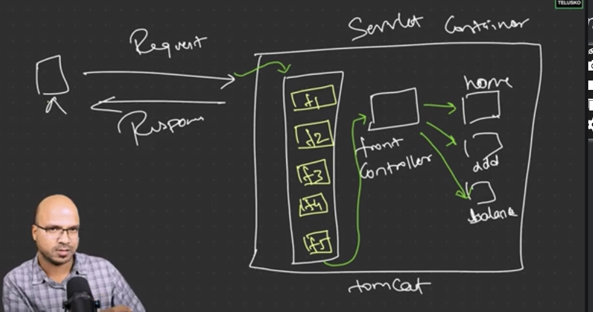

# Spring

1. most famous framework for java is Spring.
2. Spring started in 2003
3. started to solve the problem of JAVAEE
1. Java EE is complex and Heavy
4. to make it simple (Java EE) spring came

---

# IOC & Dependency injection
### IOC - Inversion of Control

as in java every thing object oriented, if we access one class
inside other class we need an object to access it.

whe you create an object you have to manage the entire cycle of object
like,
* managing the object
* destroying the object
* sometimes we don't need multiple objects

so giving the control of creating the object is IOC. this is a principle
The technic to do is called DI (Dependency injection).

### Dependency injection
DI is the actual implementation of the IOC.

* IOC is the principle
* DI is the design pattern (actual thing we do)

Without DI we have to create object using "new" keyword.

we can ask Spring framework to inject the object. You just mention the 
reference and spring give the object. this is called DI.

###  3 ways to achieve DI 
1. constructor injection

2. setter injection

3. field injection (not recommend)

## Spring Boot
opinionated framework. spring boot will make easy your configuration than Spring

* in normal web application in java we create war file and push the war file to Tomcat servers in cloud to deploy them

* In spring boot it can create a Jar file and you need external tomcat to run it. you have embedded tomcat in the project.
---
when you call "SpringApplication.run()" it will call to a container
* object are creating inside the JVM.
* inside JVM there is container called IOC container to create object to our spring project objects. In the left box is the 
our project and inside it has multiple classes. Right side inside IOC container it created two object to our classes as 
 below picture.

* SpringApplication.run() line is the one who responsible to run this IOC container.
* when you create a object using new key word, you create that object inside the JVM not in side the container. so you have 
to manage that object entire life cycle.

* type of the IOC container is Application Context.  
* Spring by default not create the objects of all the classes.
* to tell spring that which class it has to be managed (in here which class it need to create object),
we can you @Component annotation.

---
### Let's go with example

###### we use Developer.java and Laptop.java classes to this.

lets assume that we want to call developer want to access laptop class compileCode() method. if we just add Laptop laptop; as
reference variable in Developer class and access compileCode method using it, It will give a null pointer exception in runtime.
We can fix this issue by creation an object using "new" key word, but we don't want to do that in here. we want to use the 
dependency injection for spring create the object for me.

* To spring create Laptop object for us we have to add @Component annotation to Laptop class.
* TO pass or connect that created object with we can use @Autowired annotation.
* When we say Connecting it means wiring, to do this wiring automatically we can call this as Autowiring.   

#### using @Component we create object using @Autowired we connect them. Here we access all without "new" keyword by field injection.
#### We normally do not use field injection. so we can do this by constructor injection

### in Constructor Injection using @Autowired is optional. So we can use it without @Autowired keyword. but in field 
### injection and setter injection @Autowired is required.

---
now add interface named Computer and implement it from Laptop class.

As developer, you need to depend on the Computers not on the Laptops. Because of that we have changed the Laptop dependency 
injection to Computer in Developer class. But Laptop is not the only option that available to Developer. So we create a 
Desktop class and implement it also by Computer interface. 

#### now the issue is when you call the compileCode() method on Developer class, we have implement both Laptop and Desktop
#### classes with same method name. Because of that this will give a compile time error.

### In this case, in case of confusion we can use certain annotations.

1. @Primary

@Primary says in case of confusion this class is preferred.

2. @Qualifier

@Qualifier you can mentioned the name of your preferred class. but without capital letter. 

---
## Spring project without Spring Boot.

1. create a maven project
2. add spring context dependency from MVN repository to pom.xml file, to make the maven project to a Spring project.
3. access the object through spring IOC container and call the method in class Developer as below image

4. write the spring.xml file to create the object because even though we call the container and request the object object 
is not created yet. (spring.xml file need to be created under the src->main->resource folder)
5. for every classes spring call them as "Beans".
6. inside <beans> you can have multiple <bean>. Inside <bean> you have to mention which class object we want to create as
qualified name of the class as an example: com.nuwantha.Developer
7. Optionally we can provide an Id for this bean.

8. This created Id can use to mention which object you want, when you create the object without mentioning the Class name
inside the getBean() method. (Here id returns the object because of that we have to type cast it to class)

9. google spring 6 configuration xml and go to the first link and copy and past its bean definition part

### here spring will create objects only for the classes that have define bean in spring.xml file as above-mentioned.
### you can create more than one object for one class in xml file as below. Here 2 object has created for "Dev" class and one Object created for "Laptop" class.

### Setter Injection. 
#### If we want to set a values from that created object, It can achieve like below,
1. first we add variable as age to Dev.java class and make getter and setter.
2. add property name and value that we want to add to the variable. 

3. as per the above image value is only assigned to the id="dev" object. 

### Constructor Injection. 
1. here also we use same age variable to demonstrate constructor injection
2. instead of using "property" tag we use "constructor-arg" tag for constructor injection.

#### if we have multiple constructor parameters we can add indexes to specify the sequence.

now let's see what happens if we get a reference variable as Laptop class inside Dev class. 
1. handle it as a setter injection. 

add getter setters to Laptop.
2. handle it as a constructor injection.

same as setter injection but we use "constructor-arg" here.

##### now let's see how to do this with interface like we did in Spring Boot with computer interface.

in here <property> name "com" refers the Computer reference name as "com".

now if we change ref name also "com" and Laptop class id also "com". it also will work.

so, without doing this wiring manually we can tell spring to do it by adding autowire to <beans> tag. according to the 
image it says find the object by name contains "com" and auto wire it with Computer -> com reference.

##### We cannot use same id for Laptop and Desktop both, as there are ids they need to be unique.

because of that if we want to use both Laptop and Desktop we can not define both object ids same name. To achieve this we
can autowire this using "byType" (previously we used "byName").

##### make sure to add @Primary here in terms of confusion to use the preferred class.

We can get the object by Class also. not with only the id.

###  end of Spring

---
this will provide you a live reload to your backend application.

connect to H2 DB console.

If you are using Large objects like Images you have to mention that this is a large object by adding @Lob annotation in entity.

if you are sending images with our object you can not use @RequestBody annotation to catch that in back end you have to 
use @RequestPart annotation. The difference between these two is @RequestBody accept whole Json as an object. @RequestPart
accept parts in Object

As we can see in the below image, Image will accept in MultipartFile

This is how to fetch the saved Images from DB

Update object with Image

Delete image contains object

---
# Spring security

  ## OWASP website give you top 10 security risk of every year. 
you can find what are the security risk from here and fix them.

* you can get security my adding Spring Security dependency to pom.mxl file

* every controller converts to servlets behind the seen
* Tomcat run with servlet container

* now when client call a Http request, before it goes to the controllers that we created if goes to a controller called 
"front Controller". we can call it to the "dispatcher servlet" also. (check what is dispatcher servlet)

* before request call to the front controller it goes through a "filter" chains

## CSRF token

HTTP by default stateless. because of that it can not remember who you are. Because of that we should have a "session ID"
to tell server that I am this person. We got this session id when we log in to our application. As we have session Id we
do not have to login again and again.

This session ID is not changing when you refresh the application, according to the end point etc.

If you can change this session ID every time Hackers can not track it and use the ID to connect the server.

The next thing we can do is every time we send a request to the server, Server should create a unique token and we can 
send that token every time we want to send a request to server. This is called CSRF token. 

* ### After we add Spring Security to the Project, All the Post, PUT, DElETE (except GET) method request CSRF to access the endpoints
* #### This will fire unauthorized error if CSRF is not configured.

lets generate the CSRF token from the code.

as showing in the images this endpoint give you header name and CSRF token. just copy the CSRF token and add it as a header parameter.

## Doing Configurations to Spring

1. @Configuration tells that this is a configuration class to the spring
2. @EnableWebSecurity tells that do go with the default configuration and go with the configuration here. 
3. getting access of filter chain: 
 here we are getting default filter chain object. and we are going to customize it. This will 
disable the default security filter chain. as we haven't add any filtration in this level we can even log to the application
without adding user credentials.
4. first we disable CSRF by, http.csrf(customizer -> customizer.disable());
5. adding authorization to the application: http.authorizeHttpRequests(request -> request.anyRequest().authenticated()); 
6. enabling the login form: http.formLogin(Customizer.withDefaults());
7. enable for postman: http.httpBasic(Customizer.withDefaults());
8. we disabled CSRF above because of that we can handle CSRF in different ways. one is making the HTTP request Stateless.
By making HTTP request is stateless we do not have to worry about session id.
   http.sessionManagement(session -> session.sessionCreationPolicy(SessionCreationPolicy.STATELESS));
* In here as accessing every request stateless after login from login page to access our endpoint it requests new session ID 
because of that we can not use form login here.

1. UserDetailsService is the one who verify the username password. As we are going to maintain user credentials from database
we have to access this UserDetailsService object and customize it the way we want to check the credentials.
2. username and password is a authentication object. at the beginning it is not authenticated. to authenticate, it has to
go through a authentication provider.
3. There are multiple authentication providers. (for LDAP, for databases etc)

4. DaoAuthenticationProvider is the Authentication Provider for databases.

* In provider.setPasswordEncoder(new BCryptPasswordEncoder(10)); it decrypts the password and pass to provider.
* we pass our userDetailService to provider to authenticate.

5. As we are not going to use default userDetailService, we have created MyuSerDetailService class to override default one.
6. MyUserDetailsService class need to define loadUserByUsername() method that returns UserDetails.
7. As we are not going to use default UserDetails also, we have created MyUserDetails class to override default one.

## JWT

